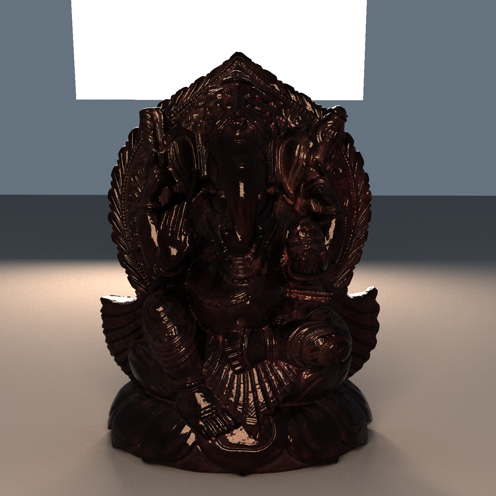

# Shimmer

Shimmer is a physically based rendering system based on the ray tracing algorithm. It is currently under development.

## Example Scenes

Test and example scenes are available in the [shimmer-scenes](https://github.com/jalberse/shimmer-scenes) repository.

# Notes

Some comments might contain a `PAPERDOC` string. This is for my own reference to find source code snippets that might be useful in a paper I plan to write regarding this project.

# Acknowledgements

Shimmer is primarily based on the pbrt-v4 rendering system from [pbrt.org](https://pbrt.org/), following "Physically Based Rendering: From Threory to Implementation" (fourth ed.) by Matt Pharr, Wenzel Jakob, and Greg Humphreys. While the pbrt-v4 source code is not present in this project (being developed in C++), its license (Apache License 2.0) is still included at licenses/pbrt.txt. Shimmer's goal isn't necessarily to be a 1:1 port of PBRT to Rust, however, so it may deviate where desired. If you're interested, [rs-pbrt](https://github.com/wahn/rs_pbrt) is a Rust implementation of PBRT v3.