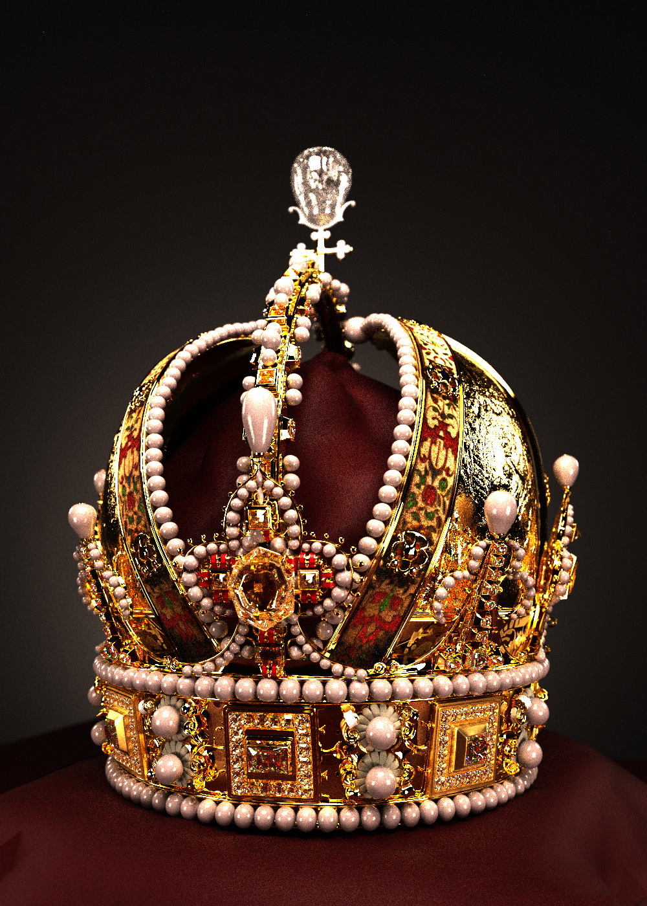

# Shimmer

Shimmer is a physically based rendering system based on the ray tracing algorithm. It is currently under development.

## Example Scenes

Render of a glass machine, showing the effects of dispersion. Model created by [@beeple](https://www.beeple-crap.com/)

A render of a crown model created by Martin Lubich.

Ganesha - a classic model with millions of triangles, scanned by Wenzel Jakob.

Test and example scenes are available in the [shimmer-scenes](https://github.com/jalberse/shimmer-scenes) repository.

# Acknowledgements

Shimmer is primarily based on the pbrt-v4 rendering system from [pbrt.org](https://pbrt.org/), following "Physically Based Rendering: From Threory to Implementation" (fourth ed.) by Matt Pharr, Wenzel Jakob, and Greg Humphreys. Shimmer's goal isn't necessarily to be a 1:1 port of PBRT to Rust, however, so it may deviate where desired. If you're interested, [rs-pbrt](https://github.com/wahn/rs_pbrt) is a Rust implementation of PBRT v3.

The parsing logic for the PBRTv4 file format was borrowed from [mxpv's implementation](https://github.com/mxpv/pbrt4), extended as necessary.

Appropriate licenses are based in the licenses/ folder.